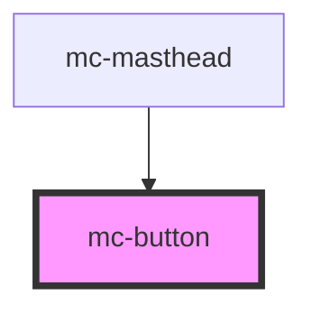

# mc-button

<!-- Auto Generated Below -->

## Properties

| Property   | Attribute  | Description | Type                              | Default     |
| ---------- | ---------- | ----------- | --------------------------------- | ----------- |
| `disabled` | `disabled` |             | `boolean`                         | `undefined` |
| `type`     | `type`     |             | `"button" \| "reset" \| "submit"` | `undefined` |

## Shadow Parts

| Part       | Description |
| ---------- | ----------- |
| `"button"` |             |

## Dependencies

### Used by

 - [mc-masthead](../../3-organisms/masthead)

### Graph

----------------------------------------------

*Built with [StencilJS](https://stenciljs.com/)*
