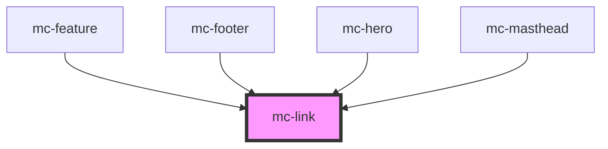

# mc-link

<!-- Auto Generated Below -->

## Properties

| Property | Attribute | Description | Type     | Default     |
| -------- | --------- | ----------- | -------- | ----------- |
| `href`   | `href`    |             | `string` | `undefined` |
| `label`  | `label`   |             | `string` | `undefined` |

## Shadow Parts

| Part  | Description |
| ----- | ----------- |
| `"a"` |             |

## Dependencies

### Used by

 - [mc-feature](../../3-organisms/feature)
 - [mc-footer](../../3-organisms/footer)
 - [mc-hero](../../3-organisms/hero)
 - [mc-masthead](../../3-organisms/masthead)

### Graph

----------------------------------------------

*Built with [StencilJS](https://stenciljs.com/)*
