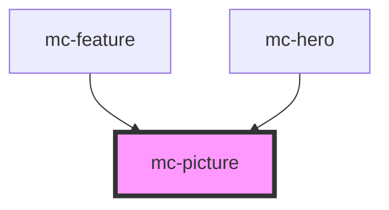

# mc-picture

<!-- Auto Generated Below -->

## Properties

| Property       | Attribute      | Description | Type     | Default     |
| -------------- | -------------- | ----------- | -------- | ----------- |
| `alt`          | `alt`          |             | `string` | `undefined` |
| `lazy`         | `lazy`         |             | `string` | `undefined` |
| `photodesktop` | `photodesktop` |             | `string` | `undefined` |
| `photomobile`  | `photomobile`  |             | `string` | `undefined` |

## Shadow Parts

| Part        | Description |
| ----------- | ----------- |
| `"picture"` |             |

## Dependencies

### Used by

 - [mc-feature](../../3-organisms/feature)
 - [mc-hero](../../3-organisms/hero)

### Graph

----------------------------------------------

*Built with [StencilJS](https://stenciljs.com/)*
