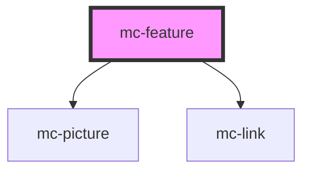

# mc-feature

<!-- Auto Generated Below -->

## Properties

| Property        | Attribute       | Description | Type     | Default     |
| --------------- | --------------- | ----------- | -------- | ----------- |
| `data`          | `data`          |             | `any`    | `undefined` |
| `sectionheader` | `sectionheader` |             | `string` | `undefined` |

## Dependencies

### Depends on

- [mc-picture](../../1-atoms/picture)
- [mc-link](../../1-atoms/link)

### Graph

----------------------------------------------

*Built with [StencilJS](https://stenciljs.com/)*
