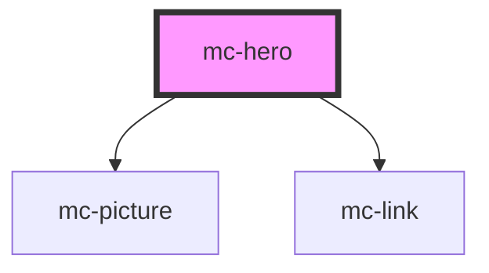

# mc-hero

<!-- Auto Generated Below -->

## Properties

| Property       | Attribute      | Description | Type     | Default     |
| -------------- | -------------- | ----------- | -------- | ----------- |
| `buttonlabel`  | `buttonlabel`  |             | `string` | `undefined` |
| `headingtext`  | `headingtext`  |             | `string` | `undefined` |
| `href`         | `href`         |             | `string` | `undefined` |
| `lazy`         | `lazy`         |             | `string` | `undefined` |
| `photodesktop` | `photodesktop` |             | `string` | `undefined` |
| `photomobile`  | `photomobile`  |             | `string` | `undefined` |
| `text`         | `text`         |             | `string` | `undefined` |

## Dependencies

### Depends on

- [mc-picture](../../1-atoms/picture)
- [mc-link](../../1-atoms/link)

### Graph

----------------------------------------------

*Built with [StencilJS](https://stenciljs.com/)*
