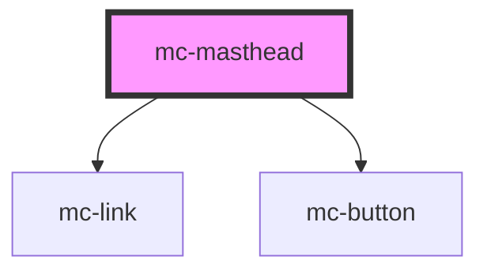

# mc-masthead

<!-- Auto Generated Below -->

## Properties

| Property   | Attribute  | Description | Type     | Default     |
| ---------- | ---------- | ----------- | -------- | ----------- |
| `imgtitle` | `imgtitle` |             | `string` | `undefined` |
| `logo`     | `logo`     |             | `string` | `undefined` |
| `nav`      | `nav`      |             | `any`    | `undefined` |

## Dependencies

### Depends on

- [mc-link](../../1-atoms/link)
- [mc-button](../../1-atoms/button)

### Graph

----------------------------------------------

*Built with [StencilJS](https://stenciljs.com/)*
